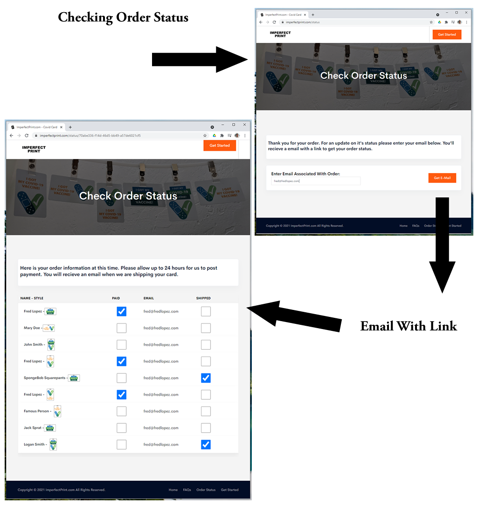
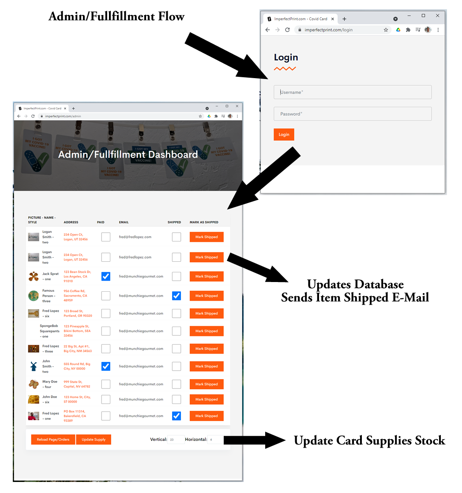

So you've got your Covid-19 Vaccine. Great! You've got a paper vaccine card, but it's a bit odd sized to fit in your wallet.

I present to you an Unofficial Covid Badge. It uses the CDC provided 'I got my vaccine' images on a credit card sized plastic name badge. You can submit an image of your vaccine record to be printed on the back!

It is real, and a processed order will have me mailing you your own Unofficial Covid Badge.

This project uses React for the client side.

The server side is NodeJS and features the use of express, jsonwebtoken, uuid, sequelize, dotenv, formidable, nodemailer and bcryptjs.

You can see it Live at [ImperfectPrint.com](https://imperfectprint.com/)

Here is the Order Flow:

When order page is loaded, it checks the the stock of cards, and shows sold out if a card is sold out.

I did not require a person to register for an account because odds are you're only going to order once, and I felt it would be a lot to ask for a user to register to be able to purchase an item that is only $5.

So for being able to check the status of your order, I went with an email verification. The person puts in the email they placed the order with and creates a code and sends it to that persons email. Then clicking or copying the link into their browser will check the code to the one saved and then display a portion of their order information.

The admin page is secured by jsonwebtoken in it's interaction with the backend. From here the stock of cards can be updated. Payment reconciliation has to be done manually, so once verifying payment through Stripe, clicking on the checkbox will update the database. Once the card is printed and ready to be mailed, clicking on the Mark Shipped button will update the database as well as send the buyer an email saying that their card has been shipped.

